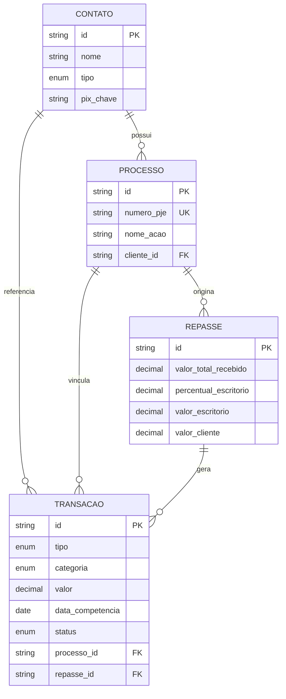

# Arquitetura — Ferreira & Rocha Financeiro

## Visão geral

SaaS privado interno para controle financeiro de escritório de advocacia.

| Camada | Tecnologia |
|--------|------------|
| Frontend | Next.js 15 (App Router), React 19, Tailwind CSS 4 |
| UI | Componentes estilo Shadcn/ui (Radix + CVA) |
| Backend | API Routes do Next.js (Server Actions ready) |
| ORM | Prisma 6 |
| Banco | PostgreSQL 16 |
| Gráficos | Recharts |
| Validação | Zod |

## Estrutura de pastas

```
src/
├── app/                    # Rotas e páginas
│   ├── page.tsx            # Dashboard
│   ├── lancamentos/novo/   # Formulário de lançamento
│   ├── repasse/            # Módulo de repasse jurídico
│   └── api/                # REST interno
├── components/
│   ├── ui/                 # Primitivos (Button, Card, Input...)
│   ├── layout/             # AppShell, navegação mobile
│   ├── dashboard/          # Cards, gráfico, listas
│   └── forms/              # LancamentoForm, RepasseForm
├── lib/
│   ├── prisma.ts           # Cliente singleton
│   ├── finance.ts          # Regras de negócio e dashboard
│   ├── repasse-calculator.ts
│   ├── validations.ts
│   └── upload.ts
└── types/
```

## Modelo de dados (ER simplificado)



## Fluxo do módulo de repasse

1. Usuário informa valor total do alvará e % do escritório (ex: 30%).
2. Sistema calcula honorários e repasse ao cliente.
3. Em uma transação atômica (`prisma.$transaction`):
   - Cria registro em `repasses`
   - **Entrada** `ALVARA_CAUSA_GANHA` (valor total, pago)
   - **Entrada** `HONORARIOS_ESCRITORIO` (parte do escritório, pago)
   - **Saída** `REPASSE_CLIENTE` (parte do cliente, **pendente**)

## Categorias por tipo

| Entrada | Saída |
|---------|-------|
| Honorários Contratuais | Audiência |
| Honorários Sucumbência | Repasse ao Cliente |
| Alvará / Causa Ganha | Advogado / Colaborador |
| Honorários Escritório* | Custo Operacional |

\* Gerado automaticamente no repasse.

## Próximos passos sugeridos

1. Autenticação interna (NextAuth ou Clerk com allowlist de e-mails)
2. CRUD de Contatos e Processos
3. Storage em S3/Cloudflare R2 para anexos em produção
4. Relatórios PDF e exportação Excel
5. Notificações de repasses pendentes
